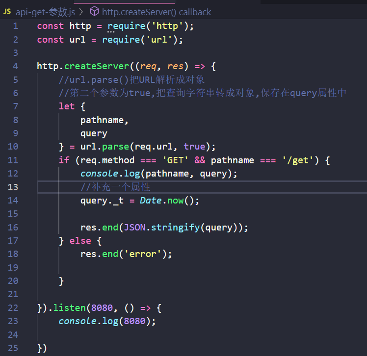
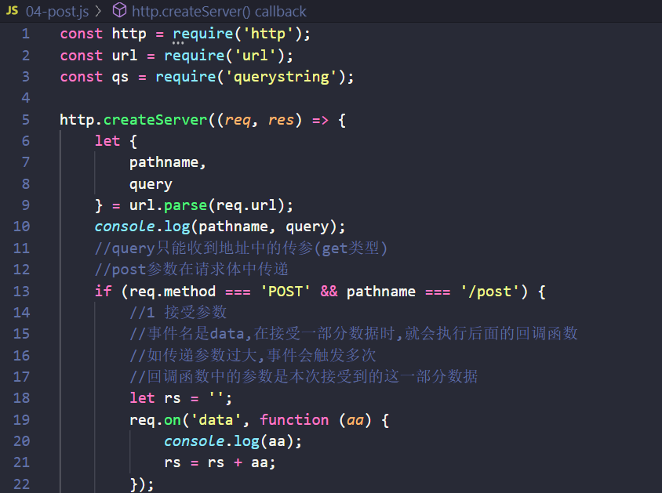
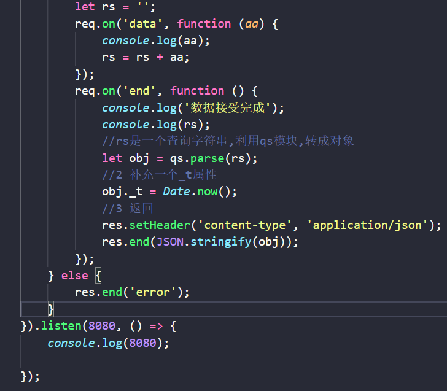

### 20-3-10

------

**node.js复习**

- api-get带参数

  

- post类型

   

  

> post类型与get类型的区别

1. 类型不同,可通过 `req.method`来获取;

2. 传参的不同

   - get请求参数在请求行中(URL后)

   - post请求参数在请求体中

     - post获取参数需要用到request对象的两个事件data和end

     - `req.on('end',function(){})`

     - `req.on('data',function(abc){})`

       每次收到部分数据就会触发一次这个事件,回调函数也会相应执行一次,`abc`是参数名,他是一个buffer.

​             

**刷题**

- css3: 移动端开发中max-device-width 与 max-width 的区别
  1. max-width 指的是显示区域的宽度,比如浏览器的显示区域宽度
  2. max-device-width 指的是设备整个渲染区域的宽度,比如设备的实际屏幕大小,也是设备分辨率
  3. max-width在窗口大小改变或者横竖屏切换时会发生变化
  4. max-device-width只与设备有关,改变时不会发生变化

- 调用canvas对象的getContext()方法来获取绘图环境

- CSS3硬件加速

  [ https://blog.csdn.net/xiebaochun/article/details/50274963 ]()

   使用3D硬件加速提升动画性能时，最好给元素增加一个z-index属性，人为 干扰复合层的排序，可以有效减少chrome创建不必要的复合层，提升渲染性能，移动端优化效果尤为明显。

- 回流必将引起重绘,重绘不一定会引起回流
- css3:
  1. rotateY:定义沿着Y轴的3D效果,可实现翻书效果;
  2. translateY:沿着Y轴移动元素
  3. scaleY:定义2D缩放转换时,改变元素的高度;定义3d缩放转换时,通过给定一个Y轴的值;
  4. perspective(n): 改变元素是怎么查看透视图(只影响3D转换元素)

- cookie

  1. cookie的有效时间默认为-1,如不设置,会默认在浏览器会话关闭时结束;

  2. 可以通过setMaxAge()方法设置cookie的生命期;

  3. 当setMaxAge(0) 表示立即删除该浏览器上指定的cookie;

  4. 在现代浏览器中,cookie可以在跨域请求中被携带在请求头中;

  5. cookie是由服务器端生成的,存放在浏览器端;

     > 关于存储
     >
     > cookie (安全,数据量小,会过期)      ------存在跨域问题
     >
     > localstorage (数据量大,不会过期,除非手动删除)

- DHTML是动态的html,是HTML,css和客户端脚本的一种集成,优点有:动态样式,动态定位,动态内容;

- H5新增的表单元素

  datalist  ,  keygen   ,  output